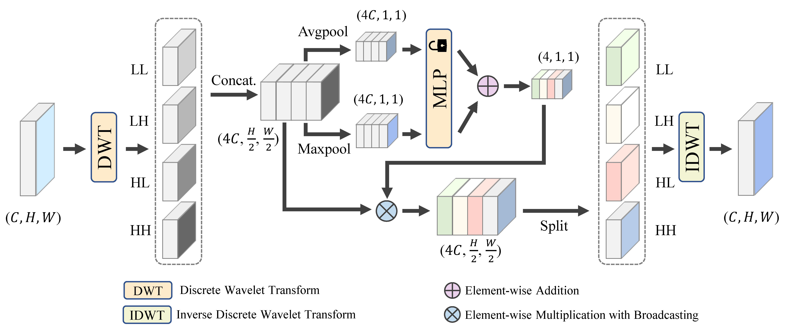

# Improving Anomaly Detection with Foundation-Model Synthesis and Wavelet-Domain Attention

<div align="center">
</h2>

[Wensheng Wu](https://scholar.google.com/citations?user=zLEZUtwAAAAJ), Zheming Lu, [Ziqian Lu](https://scholar.google.com/citations?hl=zh-CN&user=qx1yRVEAAAAJ), [Zewei He](https://scholar.google.com/citations?hl=zh-CN&user=yCHs_IsAAAAJ), Xuecheng Sun, Zhao Wang, Jungong Han, Yunlong Yu

Zhejiang University

<!-- [](https://arxiv.org/abs/2301.04805) [](https://drive.google.com/drive/folders/1Rjb8dpyNnvvr0XLvIX9fg8Hdru_MhMCj?usp=sharing) [](https://pan.baidu.com/s/1retfKIs_Om-D4zA45sL6Kg?pwd=dcyb) -->

</div>
This repo is the official implementation of:

> **Improving Anomaly Detection with Foundation-Model Synthesis and Wavelet-Domain Attention**  

---

## 📌 Overview


Architec
Industrial anomaly detection is fundamentally constrained by:

- Scarcity of defective samples
- Complex and diverse real-world anomaly patterns

We propose:

- **FMAS** — Foundation Model-based Anomaly Synthesis (training-free)
- **WDAM** — Wavelet Domain Attention Module (plug-and-play)

FMAS synthesizes realistic anomalies without fine-tuning foundation models.  
WDAM enhances anomaly-sensitive frequency components via adaptive wavelet sub-band reweighting.

The framework is validated on:

- MVTec AD
- VisA

---

## 🔥 Key Contributions

### 1. Foundation Model-based Anomaly Synthesis (FMAS)

- Training-free anomaly generation pipeline
- GPT-based prompt generation
- SAM-based foreground mask extraction
- Stable Diffusion-based inpainting
- LPIPS filtering for anomaly intensity control
- One-to-one pairing with original normal samples

---

### 2. Wavelet Domain Attention Module (WDAM)

- Haar wavelet decomposition (LL, LH, HL, HH)
- Learnable sub-band attention
- Inverse wavelet reconstruction
- Lightweight and architecture-agnostic
- Minimal parameter and FLOPs overhead

---

### 3. Strong Empirical Improvements

Example results on MVTec AD:

| Model | Params (MB) | FLOPs (G) | Image AUROC |
|-------|------------|-----------|-------------|
| WideResNet50-2 | 67.40 | 29.92 | 96.54 |
| + WDAM | 67.59 | 29.94 | 98.00 |

---

## 🧠 Method Pipeline

### FMAS

1. Foreground mask generation  
2. Text prompt generation  
3. Diffusion-based inpainting  
4. LPIPS-based filtering  

Each normal image is paired with a synthesized anomalous counterpart.

---

### WDAM

1. Wavelet decomposition  
2. Sub-band attention learning  
3. Adaptive reweighting  
4. Inverse wavelet reconstruction  
5. Residual feature enhancement  

---

## 🚀 Installation

```bash
git clone https://github.com/your-repo-name.git
cd your-repo-name

conda create -n fmas_wdam python=3.10
conda activate fmas_wdam

pip install -r requirements.txt